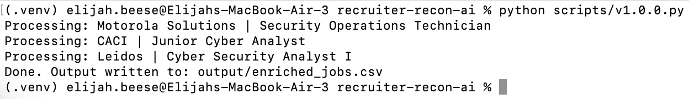

# recruiter-recon-ai

AI-assisted job targeting pipeline for cybersecurity roles.

This project helps automate the front end of a job search workflow by turning job postings into structured, reviewable data. Instead of manually scanning roles one at a time, the script pulls job information, analyzes required skills and qualifications, compares them against a candidate profile, assigns a fit score, and attempts to identify recruiter or recruiting contacts for manual verification.

This is designed as a review-first workflow, not a blind outreach machine.

## Features

- Reads seed job targets from CSV or Google Sheets
- Pulls public job description text from job URLs
- Uses the OpenAI API to extract requirements and classify fit
- Scores alignment based on entry-level suitability, clearance language, and skills match
- Uses Hunter to find likely recruiter or recruiting contacts by company domain
- Exports enriched results to CSV for human review

## Workflow

1. Job URLs are added to a seed spreadsheet or CSV.
2. The script fetches the job page text.
3. An LLM extracts skills, experience requirements, and role characteristics.
4. The system compares the job against a structured candidate profile.
5. A fit score is generated based on skill alignment and role criteria.
6. The company domain is analyzed to identify likely recruiter or talent contacts.
7. The results are exported to a structured spreadsheet for manual review.

## Why this exists

Hiring pipelines increasingly rely on automated systems to parse resumes and filter candidates before a recruiter ever reads them. This project takes the opposite-side view of that problem and applies automation to the job search itself.

Instead of manually reviewing hundreds of roles, this workflow identifies which jobs are most worth pursuing and prepares structured outreach intelligence for review.

## Setup
* **Clone the repository**
  * `git clone https://github.com/elijahbeese/recruiter-recon-ai.git`
  * `cd recruiter-recon-ai`
  
 * **Create and activate a virtual environment**
   *  **macOS / Linux**
      * `python3 -m venv .venv`
      * `source .venv/bin/activate`
   * **Windows PowerShell**
     * `python -m venv .venv`
     * `.venv\Scripts\Activate.ps1`
  
* **Install dependencies**
  * `pip install -r requirements.txt`
  
* **Configure environment variables**
  * Copy .env.example to .env.
  
* **macOS / Linux**
  * `cp .env.example .env`
* **Windows PowerShell**
  * `copy .env.example .env`
    
* **Then fill in your API keys.**
  * `OPENAI_API_KEY=your_openai_key`
  * `HUNTER_API_KEY=your_hunter_key`
  
* **Edit your candidate profile**
  * Update candidate_profile.json with your actual experience, skills, certifications, interests, and conservative clearance wording.
  
* **Add job targets**
  * Populate input_jobs.csv with company names, domains, job titles, URLs, and locations.
  
* **Run the script**
  * `python scripts/v1.0.0.py`

## Example Output


  
* **Review output**
  * **Open:**
    * output/enriched_jobs.csv
   
## Tech Stack

* Python
* OpenAI API – job description analysis and skill extraction
* Hunter API – recruiter and talent contact discovery
* BeautifulSoup – job page parsing
* Pandas – structured data processing
* dotenv – API configuration
* tldextract – company domain parsing

## Repository Structure

```
recruiter-recon-ai
│
├── candidate_profile.json      # Candidate background used for job matching
├── input_jobs.csv              # Job listings to analyze
├── requirements.txt            # Python dependencies
├── README.md
│
├── scripts
│   └── v1.0.0.py               # Main V1 pipeline
│
├── assets                      # Screenshots and diagrams
│
└── output
    └── enriched_jobs.csv       # Final AI-enriched results
```

## Recruiter Recon AI – Version 1

Version 1 demonstrates the **job enrichment pipeline**.

The system analyzes cybersecurity job postings and determines how well they match the candidate’s background. It uses structured candidate data and AI-assisted analysis to evaluate job fit.

### What V1 Does

V1 performs the following workflow:

1. Load the candidate profile from `candidate_profile.json`
2. Load job listings from `input_jobs.csv`
3. Attempt to fetch the job description from each job URL
4. Use AI to analyze the job description and determine:
   - Entry level fit
   - Clearance relevance
   - Required skills
   - Preferred skills
   - Overall job fit score
5. Output the results to `output/enriched_jobs.csv`

This version **does not search for jobs automatically**.  
Jobs must be provided in `input_jobs.csv`.

Automated job discovery will be implemented in **Version 2**.
