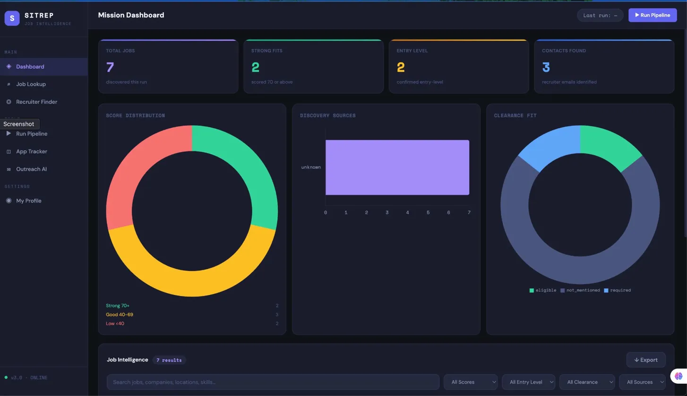
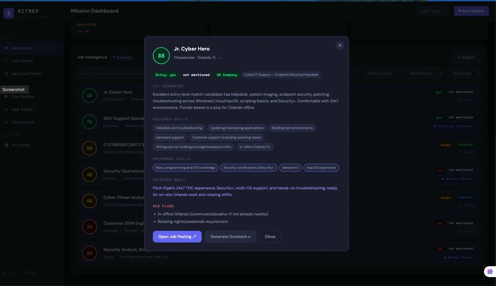
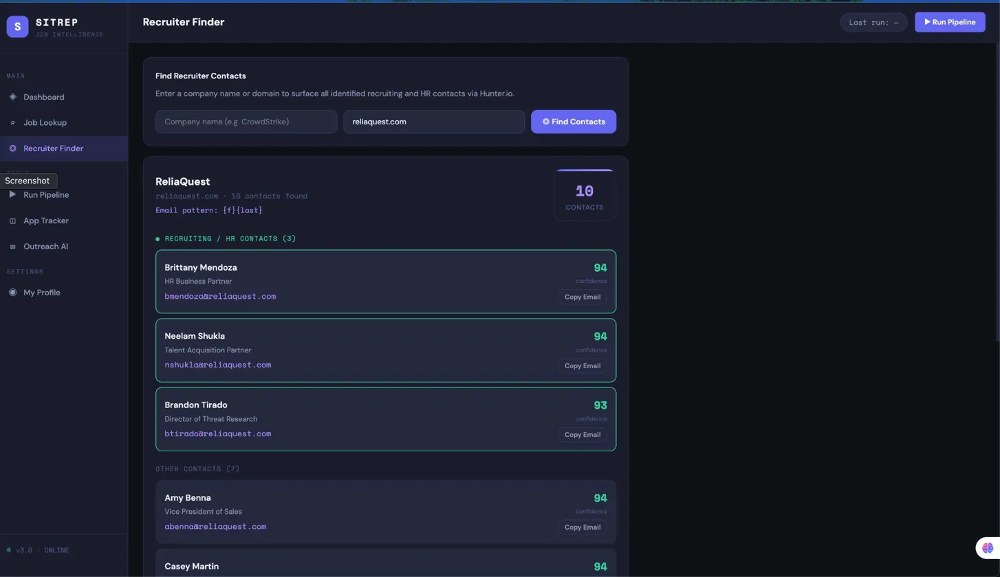
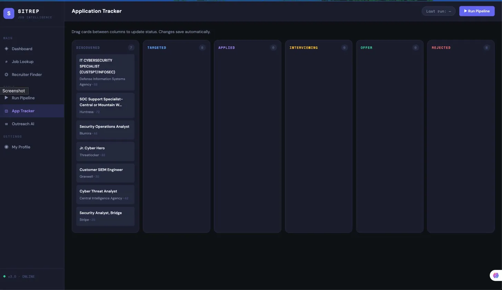
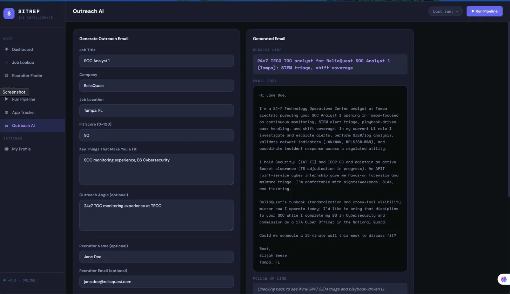
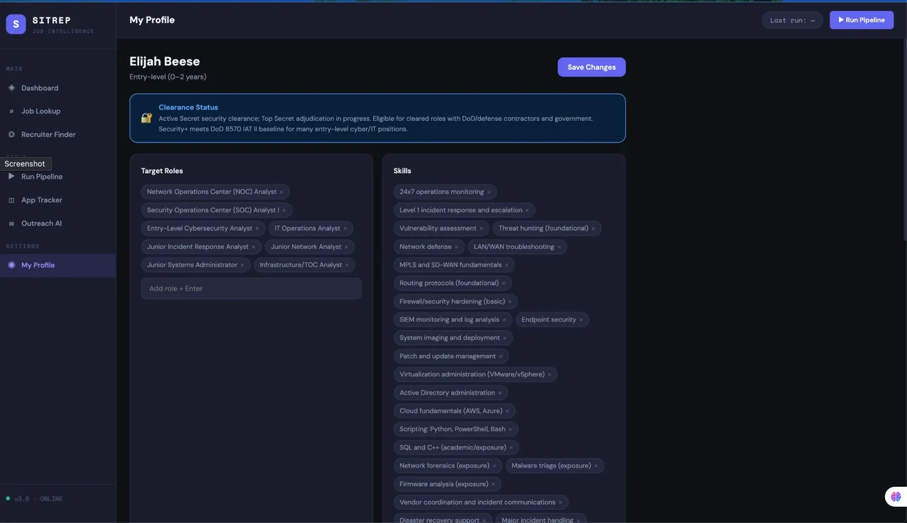
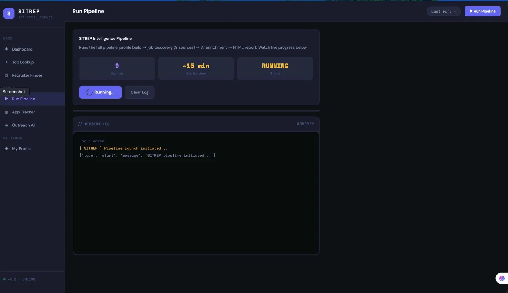

# SITREP — Job Intelligence Platform


> **Situation Report. Job Intelligence. Built for cybersecurity professionals.**
> Resume in. Mission-ready opportunities out.

SITREP is a local AI-powered job intelligence platform that automates the front end of a cybersecurity job search. It discovers relevant roles across 9 sources, scores each one against your resume using AI, identifies recruiter contacts, and presents everything in an interactive web dashboard — all running locally on your machine.

This is a **review-first workflow**, not a blind outreach machine. Every output is designed for human review before any action is taken.

---

## 📋 Table of Contents

- [How It Works](#how-it-works)
- [SITREP Dashboard](#sitrep-dashboard)
- [Discovery Sources](#discovery-sources)
- [Company Coverage](#company-coverage)
- [Setup](#setup)
- [Running the Pipeline](#running-the-pipeline)
- [Running the Dashboard](#running-the-dashboard)
- [Output Files](#output-files)
- [Repository Structure](#repository-structure)
- [Tech Stack](#tech-stack)
- [Version History](#version-history)
- [Roadmap](#roadmap)

---

## ⚙️ How It Works

```
┌─────────────────────────────────────────────────────────────┐
│                        YOUR RESUME                          │
│                    (PDF / DOCX / TXT)                       │
└─────────────────────┬───────────────────────────────────────┘
                      │
                      ▼
┌─────────────────────────────────────────────────────────────┐
│                  STEP 1 — PROFILE BUILD                     │
│   AI parses resume → structured JSON candidate profile      │
│   Target roles · Skills · Tools · Certs · Clearance         │
│   Location preferences · Search query generation            │
└─────────────────────┬───────────────────────────────────────┘
                      │
                      ▼
┌─────────────────────────────────────────────────────────────┐
│              STEP 2 — JOB DISCOVERY (v2.4)                  │
│                                                             │
│   9 sources queried:                                        │
│   USAJobs API · ClearanceJobs · Indeed · Dice               │
│   LinkedIn · Greenhouse (100+ cos) · Lever (50+ cos)        │
│   Workday (20 cos) · iCIMS (10 cos)                         │
│                                                             │
│   → Senior role filter                                      │
│   → Relevance filter (non-cyber removed)                    │
│   → Heuristic scoring (source quality + skill overlap)      │
│   → Company + title deduplication                           │
│   → AI reranking — only 50+ scores passed forward           │
└─────────────────────┬───────────────────────────────────────┘
                      │
                      ▼
┌─────────────────────────────────────────────────────────────┐
│              STEP 3 — AI ENRICHMENT (v2.0)                  │
│                                                             │
│   Pre-filter: removes irrelevant and senior roles           │
│   Batched AI scoring (15 jobs per API call)                 │
│   · Entry-level fit · Clearance fit · Score (0-100)         │
│   · Required skills · Preferred skills                      │
│   · Fit reasoning · Outreach angle · Red flags              │
│   · Salary estimate                                         │
│                                                             │
│   Recruiter enrichment (Hunter.io):                         │
│   · Skips .gov/.mil domains                                 │
│   · Filters generic junk emails                             │
│   · Named recruiter + email + confidence score              │
└─────────────────────┬───────────────────────────────────────┘
                      │
                      ▼
┌─────────────────────────────────────────────────────────────┐
│              STEP 4 — SITREP DASHBOARD (v3.0)               │
│                                                             │
│   Local Flask web app at http://127.0.0.1:5000             │
│   · Mission Dashboard · Job Lookup · Recruiter Finder       │
│   · Pipeline Runner · App Tracker · Outreach AI · Profile   │
└─────────────────────────────────────────────────────────────┘
```

---

## 🖥️ SITREP Dashboard

### Mission Dashboard

Browse all enriched jobs with live charts showing score distribution, source breakdown, and clearance fit. Filter by score, entry-level status, clearance requirement, and source. Search across all fields. Click any job card to open a full detail modal.



---

### Job Detail Modal

Click any job card to open full intelligence on that role — fit score, entry-level and clearance classification, required and preferred skills, outreach angle, red flags, and recruiter contact. One click to open the posting or generate a cold email.



---

### Recruiter Finder

Enter a company name or domain. Returns all identified recruiting and HR contacts sorted by relevance, with names, emails, job titles, and Hunter.io confidence scores. Email pattern shown for the domain.



---

### Application Tracker

Kanban board with six columns: Discovered, Targeted, Applied, Interviewing, Offer, Rejected. Drag cards between columns to update status. Click any card to add notes and application date. All changes save automatically and persist between sessions.



---

### Outreach AI

Fill in the job details and generate a tailored cold outreach email using your actual profile and the specific role. References real tech stack language, your clearance, your experience. Three tone options. Includes subject line, email body, follow-up line, and key hooks. One-click copy or open in mail client.



---

### My Profile

View and edit your full candidate profile in the UI. Add or remove target roles, skills, tools, certifications, location preferences, and search queries using a tag-based editor. Clearance status prominently displayed. All changes save back to `candidate_profile_generated.json`.



---

### Pipeline Runner

Launch the full discovery and enrichment pipeline directly from the browser. Watch a live terminal log stream in real time as each source runs, jobs are discovered, and enrichment completes.



---

## 🌐 Discovery Sources

| Source | Type | What It Finds | Status |
|---|---|---|---|
| **USAJobs API** | Official API | Federal, DoD, cleared cyber roles | ✅ Active |
| **ClearanceJobs** | RSS Feed | Private sector cleared positions | ⚠️ Intermittent |
| **Indeed** | RSS Feed | Broad market, small contractors | ❌ Blocked (403) |
| **Dice** | RSS Feed | Tech/cyber contractor roles | ❌ Dead endpoint |
| **LinkedIn** | HTML Scrape | General job market | ⚠️ Blocked (best-effort) |
| **Greenhouse** | Direct JSON API | 100+ cyber/defense/private sector boards | ✅ Active |
| **Lever** | Direct JSON API | 50+ defense tech/cyber company boards | ✅ Active |
| **Workday** | Direct API | 20 defense prime + enterprise employers | 🔧 Partial |
| **iCIMS** | HTML Scrape | 10 traditional defense contractors | ✅ Partial |

---

## 🏢 Company Coverage

**Defense & Government Contractors**
Leidos · Northrop Grumman · L3Harris · BAE Systems · General Dynamics · Lockheed Martin · Boeing · Raytheon · SAIC · Peraton · Parsons · Amentum · Booz Allen Hamilton · ManTech · CACI · MITRE · Telos

**Pure-Play Cybersecurity**
CrowdStrike · SentinelOne · Huntress · ThreatLocker · Expel · Red Canary · Blumira · Dragos · Claroty · Recorded Future · Flashpoint · Vectra · Exabeam · Anomali · Cybereason · Arctic Wolf · DeepWatch · NetSPI · Bishop Fox · NCC Group · Mandiant · Kroll · Secureworks · Trellix · Rapid7 · Tenable · Qualys · Palo Alto Networks · Fortinet · BeyondTrust · CyberArk · Okta

**Banks & Financial Services**
Capital One · USAA · JPMorgan Chase · Bank of America · Citigroup · Wells Fargo · Raymond James · Fidelity · Charles Schwab · Visa · Mastercard · PayPal · Stripe · Robinhood · Coinbase

**Big Tech**
Microsoft · Google · Amazon · Apple · Meta · IBM · Oracle · Salesforce · ServiceNow · Splunk · Cloudflare · Datadog · Elastic

**Consulting / Big 4**
Deloitte · PwC · KPMG · EY · Accenture

**Healthcare**
HCA Healthcare · AdventHealth · BayCare · Cigna · UnitedHealth · Humana

**Critical Infrastructure / Energy**
NextEra Energy · Duke Energy · Dominion Energy · Constellation Energy · AECOM · Jacobs

**Telecom**
Verizon · AT&T · T-Mobile · Comcast · Lumen

**Tampa / Florida Specific**
Raymond James · Tech Data · USAA Tampa · Catalina · Verizon Business

---

## 🚀 Setup

### 1. Clone the repository

```bash
git clone https://github.com/elijahbeese/recruiter-recon-ai.git
cd recruiter-recon-ai
```

### 2. Create and activate a virtual environment

```bash
# macOS / Linux
python3 -m venv .venv
source .venv/bin/activate

# Windows PowerShell
python -m venv .venv
.venv\Scripts\Activate.ps1
```

### 3. Install dependencies

```bash
pip install -r requirements.txt
```

### 4. Configure environment variables

```bash
cp .env.example .env
nano .env
```

```env
OPENAI_API_KEY=your_openai_key
HUNTER_API_KEY=your_hunter_key
USAJOBS_API_KEY=your_usajobs_key
USAJOBS_USER_AGENT=your_email@example.com
```

> **Getting API keys:**
> - **OpenAI:** [platform.openai.com](https://platform.openai.com)
> - **Hunter.io:** [hunter.io](https://hunter.io) — free tier available
> - **USAJobs:** [developer.usajobs.gov](https://developer.usajobs.gov/APIRequest/) — free, instant

### 5. Add your resume

```
resumes/resume.pdf     ← preferred
resumes/resume.docx
resumes/resume.txt
```

---

## ▶️ Running the Pipeline

```bash
python scripts/run_v2_4.py
```

Or launch it from the SITREP dashboard using the **Run Pipeline** page.

| Step | What Happens | Estimated Time |
|---|---|---|
| Profile Build | AI parses resume → JSON profile | 30–60 sec |
| Job Discovery | 9 sources, 500 raw → 50+ threshold | 5–10 min |
| AI Enrichment | Batched scoring + Hunter contacts | 5–10 min |
| **Total** | | **~15–20 min** |

---

## 🌐 Running the Dashboard

```bash
python run_app.py
```

Browser opens automatically. If using Chrome, navigate to:

```
http://127.0.0.1:5000
```

> **Note:** Use `127.0.0.1:5000` instead of `localhost:5000` in Chrome to avoid a known localhost access restriction.

---

## 📁 Output Files

| File | Description | Persists |
|---|---|---|
| `candidate_profile_generated.json` | AI-parsed candidate profile | ✅ Yes |
| `output/raw_discovered_jobs.csv` | All discovered jobs pre-reranking | Until next run |
| `output/discovered_jobs.csv` | 50+ scored jobs passed to enrichment | Until next run |
| `output/enriched_jobs.csv` | Full enriched dataset with scores + contacts | Until next run |
| `output/enriched_jobs.html` | Standalone browser report | Until next run |
| `output/tracker.json` | Application tracker state | ✅ Persists between sessions |

---

## 🗂️ Repository Structure

```
recruiter-recon-ai/
│
├── resumes/
│   └── resume.pdf
│
├── scripts/
│   ├── build_profile_v2_0.py       # Resume → candidate profile (AI)
│   ├── parse_resume_v2_0.py        # Resume text extraction
│   ├── discover_jobs_v2_4.py       # Discovery engine — 9 sources
│   ├── recruiter_recon_v2_0.py     # Enrichment — batched AI + Hunter
│   └── run_v2_4.py                 # Pipeline orchestrator
│
├── app/                            # SITREP Flask dashboard
│   ├── __init__.py
│   ├── routes/
│   │   ├── dashboard.py
│   │   ├── lookup.py
│   │   ├── recruiter.py
│   │   ├── pipeline.py
│   │   ├── tracker.py
│   │   ├── outreach.py
│   │   └── profile.py
│   ├── templates/
│   │   ├── base.html
│   │   ├── dashboard.html
│   │   ├── lookup.html
│   │   ├── recruiter.html
│   │   ├── pipeline.html
│   │   ├── tracker.html
│   │   ├── outreach.html
│   │   └── profile.html
│   └── static/
│       ├── css/main.css
│       └── js/main.js
│
├── run_app.py                      # SITREP entry point
│
├── output/                         # Gitignored — generated per run
│   ├── raw_discovered_jobs.csv
│   ├── discovered_jobs.csv
│   ├── enriched_jobs.csv
│   ├── enriched_jobs.html
│   └── tracker.json
│
├── assets/
│   └── screenshots/
├── .env
├── .env.example
├── requirements.txt
└── README.md
```

---

## 🛠️ Tech Stack

| Component | Library / Service | Purpose |
|---|---|---|
| Language | Python 3.10+ | Core |
| Web Framework | Flask 3.0+ | SITREP local dashboard |
| AI | OpenAI API | Resume parsing, job scoring, outreach generation |
| Job data | USAJobs API | Federal/DoD job discovery |
| Job data | Greenhouse API | Direct ATS board queries (100+ companies) |
| Job data | Lever API | Direct ATS board queries (50+ companies) |
| Recruiter data | Hunter.io API | Contact identification |
| Parsing | BeautifulSoup4 | HTML job page parsing |
| Data | Pandas | CSV processing |
| HTTP | Requests | API and web requests |
| Config | python-dotenv | Environment variables |
| Domains | tldextract | Company domain parsing |

---

## 📜 Version History

### `v1.0` — Job Enrichment Pipeline
Manual workflow. Provide job URLs in `input_jobs.csv`. AI scores each posting against your candidate profile and outputs fit scores and recruiter contacts. No automated discovery.

---

### `v2.0` — Resume-Driven Discovery
Automated resume parsing and AI-generated candidate profile. Discovery engine used DuckDuckGo HTML scraping to find job postings across ATS platforms.

---

### `v2.1` — Discovery Improvements
Improved heuristic scoring with profile alignment. Better ATS source classification. AI-assisted reranking. LinkedIn URL support. Profile-aligned query generation from resume.

---

### `v2.2` — Rate Limiting & Query Budget
Fixed silent discovery failures from DuckDuckGo rate limiting. Randomized sleep, exponential backoff, wildcard query removal, hard query budget cap.

---

### `v2.3` — Multi-Source Discovery Engine
Complete replacement of DuckDuckGo with 9 dedicated sources. USAJobs API, Greenhouse, and Lever became primary active sources. Sample run: 300 raw → 98 enriched. Top results included NSA, CIA, DISA, Air Force, Booz Allen, Huntress, ThreatLocker, Palantir.

---

### `v2.4` — Private Sector Expansion + Quality Filter
- Greenhouse expanded to 100+ companies including banks, big tech, consulting, healthcare, energy, and Tampa-specific employers
- Lever expanded to 50+ companies
- Score threshold at 50+ — low-quality results eliminated before enrichment
- Deduplication by company + normalized title
- Batched AI enrichment — runtime reduced from 90 min to under 15 min
- Clearance context passed explicitly to AI
- Hunter skips .gov/.mil domains, junk emails filtered
- HTML report generated alongside CSV

---

### `v3.0` — SITREP Web Dashboard *(current)*
Full local Flask web application replacing manual CSV review.

- **Mission Dashboard** — live charts, filterable job cards, detail modals, recruiter contacts inline
- **Job Lookup** — paste any job URL for on-demand AI scoring and recruiter contact lookup
- **Recruiter Finder** — domain search returns all HR contacts with confidence scores
- **Pipeline Runner** — launch full pipeline from browser with live terminal log streaming
- **Application Tracker** — Kanban board with persistent storage, drag-and-drop status updates
- **Outreach AI** — tailored cold emails in three tones, subject line, follow-up line, one-click mailto
- **Profile Editor** — tag-based UI for editing all profile fields, saves to JSON

---

## 🗺️ Roadmap

### `v3.1` — Persistence & Polish *(next)*
- Save Job Lookup and Outreach history between sessions
- Cache Recruiter Finder results per domain
- Remember dashboard filter state
- Fix Workday company slugs
- Improve ClearanceJobs reliability
- Replace dead Indeed/Dice endpoints

### `v4.0` — Autonomous Agent *(future)*
- Scheduled pipeline runs — monitor target companies for new postings
- Delta detection — surface only new jobs since last run
- Email or Slack digest of top opportunities
- Full outreach campaign management with tracking

---

## ⚠️ Disclaimer

This tool is for personal job search use only. It does not automate job applications or recruiter outreach. All output is intended for human review before any action is taken. Respect the terms of service of any platform queried.
